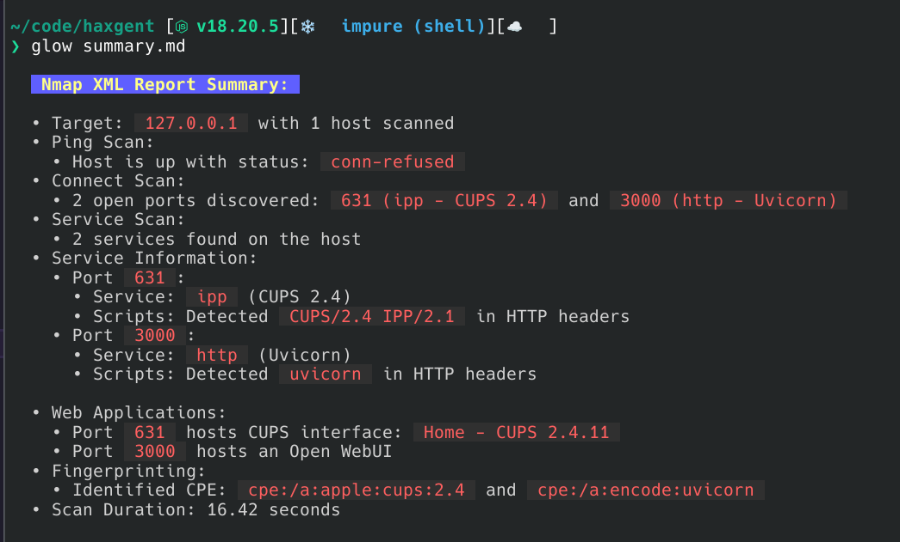

### Haxgent

Playing around with agentic approach to very basic reconnaissance tasks.
Generated report in MD format can be previewed using e.g. glow (`glow summary.md`)

### Development

Current requirements:
- Rustscan
- OpenAI key
- nmap-formatter binary 

I am using a NixOS shell (with Deno installed) but the packages are available on any system probably.

`nix-shell -p rustscan nmap-formatter glow`

### Changelog
- 0.0.1 - Initial script which does a basic scan sequentially (hardcoded to `localhost`)
