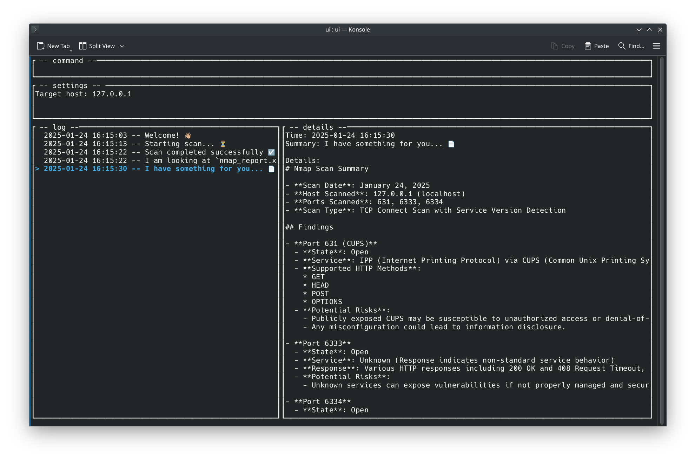

### Haxgent

Playing around with agentic approach to very basic reconnaissance tasks.
Generated report in MD format can be previewed using e.g. glow (`glow summary.md`)

### Commands

- `sethost <host>` - set host to scan
- `poke` - run scan (automatically poked when setting host)
- `quit` - exit (also Esc)

The log can be browsed using the arrow keys. Commands can be entered directly in the input field on the top.

### Development

Current requirements:
- Rustscan
- OpenAI key
- nmap-formatter binary 

I am using a NixOS shell (with Rust pre-installed) but the packages are available on any system probably.

`nix-shell -p rustscan nmap-formatter glow pkg-config openssl`

### Changelog
- 0.3.1 - Added some emojis to the Log output (critical change)
- 0.3.0 - Added tool to use ChatGPT (rewritten ChatService from TS)
- 0.2.0 - Added tool to use system command (hardcoded to Rustscan)
- 0.1.0 - Started rewriting from TS to Rust (was not able to easily build TUI with TypeScript)
- 0.0.1 - Initial script which does a basic scan sequentially (hardcoded to `localhost`)
